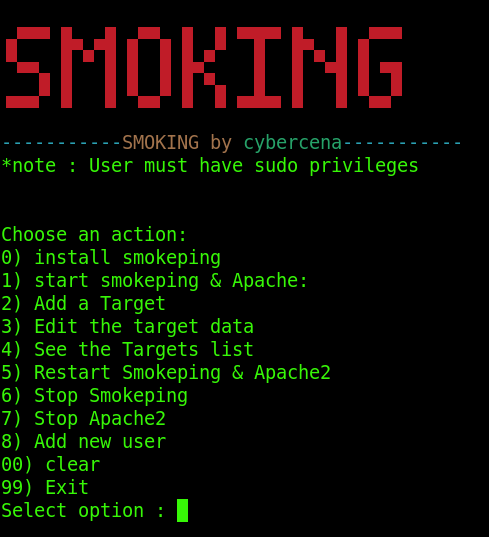

# Smoking
This is a script that create a menu-based terminal application to control smokeping.

# Setup
1. Download the script from github : ```git clone https://github.com/cybercena/Smoking.git```

2. Enter to Smoking folder : ```cd Smoking```

3. give executing permission to smoking.sh file : ```chmod +x smoking.sh```

4. Run with sudo privileges : ``sudo ./smoking.sh``
5. install smokeping by selecting option '0'

#Requirements
``smokeping`` and ``apache2``

## Notes:
all the distros that support ``apt`` can directly install smokeping using the install options from Smoking's GUI. This scripts is written specially focusing kalilinux user and debian based system.


